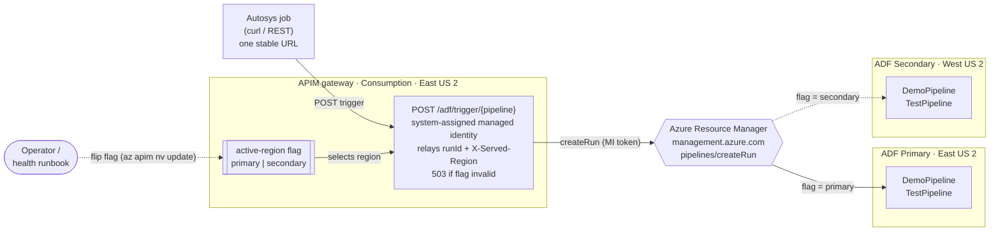
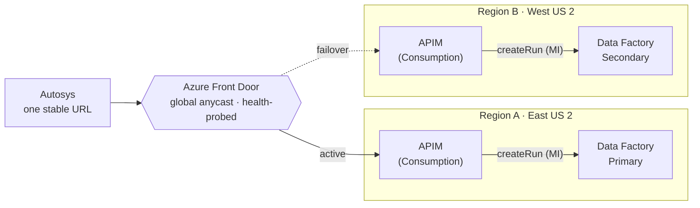
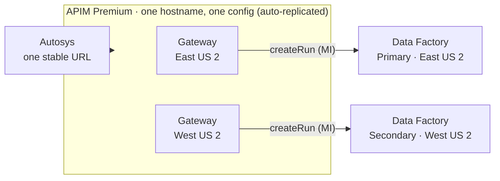

# ADF Cross-Region DR — APIM active-region routing

A deployable reference demo that answers a real customer question:

> *"We trigger Azure Data Factory pipelines from Autosys using the ADF REST API. Without
> changing anything on the application side, can APIM send the request to the ADF factory in
> whichever region is currently active, and fail over without changing the application?"*

**Short answer:** yes. Put a thin **API Management (APIM)** façade in front of ADF that exposes
one stable endpoint, and let an **`active-region` flag** inside APIM decide which regional
factory to trigger. The calling application always uses the **same URL**; you fail over by
flipping the flag, entirely inside APIM, with no app change and no external router.

```
Autosys ─▶ APIM   POST /adf/trigger/{pipeline}
             │  reads named value  active-region = primary | secondary
             ├─ primary   ─▶ Data Factory (East US 2)   → returns runId
             └─ secondary ─▶ Data Factory (West US 2)   → returns runId
```

The caller never touches Azure AD tokens or region-specific URLs — APIM's **managed identity**
calls ADF's `createRun` API on its behalf, and each response carries an `X-Served-Region`
(`primary`/`secondary`) header so you can see which region handled it.

---

## Architecture



### Request flow
1. Autosys calls `POST https://<apim-host>/adf/trigger/{pipeline}` — one unchanging URL. Any
   pipeline deployed to the active factory works (the demo ships `DemoPipeline` and `TestPipeline`).
2. The APIM policy reads the **`active-region`** named value — returning **503** if it is not
   `primary`/`secondary` — and builds the ADF `createRun` URL for that region's factory,
   URL-encoding the pipeline name.
3. It attaches an ARM token from APIM's **system-assigned managed identity** (which holds
   **Data Factory Contributor** on **both** factories) and calls `createRun` via Azure Resource
   Manager.
4. ADF starts the pipeline run and returns a `runId`, which APIM relays with an
   `X-Served-Region` header. To fail over, an operator or health runbook flips the flag.

---

## How the "active region" is decided

The `active-region` named value is the single source of truth. APIM triggers **only** the
factory in that region and returns its real response — there is no automatic cross-region
retry, which keeps triggering deterministic and avoids accidental double-runs. You fail over by
flipping the flag, with `scripts/switch-region` or `az apim nv update`; no application change is
required. Flip it from:

- an **operator** during a declared failover, or
- an **automated health runbook** that watches real data-plane / integration-runtime health
  and sets `active-region` to the region that should serve traffic.

> **Why flag-driven and not automatic?** `createRun` returning `200` only means ARM *accepted*
> the run — not that the pipeline will succeed (a region's integration runtime or data tier
> could be down while ARM is fine). And because `createRun` is **not idempotent**, silently
> retrying the other region on a lost response could start the pipeline **twice**. Driving
> failover from a real health signal (the flag) avoids both problems.

---

## Repository layout

```
infra/
  main.bicep                 # Orchestration (RG-scoped): 1 APIM, 2 ADF, role assignments
  main.parameters.json       # Sample parameters
  modules/
    dataFactory.bicep        # ADF + two dependency-free pipelines: DemoPipeline (Wait) and TestPipeline (parameterized)
    apim.bicep               # APIM Consumption + MI + active-region /adf/trigger policy
policies/
  active-region-policy.xml   # Human-readable copy of the active-region routing policy
scripts/
  deploy.{sh,ps1}            # Create RG + deploy
  demo.{sh,ps1}              # Call the single endpoint, print serving region + failover flag
  switch-region.{sh,ps1}     # Flip the active-region flag (no app change)
  teardown.{sh,ps1}          # Delete everything (one resource group)
docs/
  architecture.md            # Deeper design notes + production hardening
```

---

## Prerequisites

- **Azure CLI** 2.60+ and **Bicep** (`az bicep install`)
- Signed in: `az login` and `az account set --subscription "<name-or-id>"`
- Role: **Owner** or **User Access Administrator** on the subscription/RG
  (needed to grant APIM's identity **Data Factory Contributor**)
- Providers registered (the deploy handles this if you haven't):
  ```bash
  az provider register -n Microsoft.ApiManagement
  az provider register -n Microsoft.DataFactory
  ```

---

## Deploy

```bash
# bash
export PUBLISHER_EMAIL="you@contoso.com"
./scripts/deploy.sh
```
```powershell
# PowerShell
.\scripts\deploy.ps1 -PublisherEmail you@contoso.com
```

APIM **Consumption** tier provisions in a few minutes (vs ~30–45 min for Developer/Premium),
which keeps this demo fast and cheap. The deploy prints outputs including `apimHost` and
`triggerUrl`.

---

## Run the demo

```bash
./scripts/demo.sh
```
```powershell
.\scripts\demo.ps1
```

Expected output (abridged) — note `X-Served-Region`:

```
Application endpoint (unchanged across failovers):
  POST https://apim-adfdr-pri-xxxx.azure-api.net/adf/trigger/DemoPipeline
HTTP/1.1 200 OK
X-Served-Region: primary
{"runId":"e1f2...."}
```

## Fail over — no application change

```bash
./scripts/demo.sh                     # served by primary
./scripts/switch-region.sh secondary  # flip the active-region flag (APIM-side)
./scripts/demo.sh                     # SAME URL, now served by secondary
./scripts/switch-region.sh primary    # flip back
```
```powershell
.\scripts\demo.ps1
.\scripts\switch-region.ps1 -Region secondary
.\scripts\demo.ps1
.\scripts\switch-region.ps1 -Region primary
```

After the switch, `X-Served-Region` flips to `secondary` and the pipeline runs in the secondary
factory — same client, same hostname, zero application changes.

### Triggering other pipelines

The endpoint takes the pipeline name in the path, so it triggers **any** pipeline that exists in
the active region's factory. The repo deploys two into both factories:

- `DemoPipeline` — a single `Wait` activity.
- `TestPipeline` — a parameterized pipeline (`message` parameter with a default) that sets a
  variable then waits, showing that parameterized pipelines trigger fine with the current policy.

```bash
curl -X POST https://<apim-host>/adf/trigger/TestPipeline
```

Because the deployed policy sends an empty body (`{}`), pipeline parameters use their defaults.
To pass caller-supplied parameters through to `createRun`, forward the request body in the
policy instead of `{}` (see [`docs/architecture.md`](docs/architecture.md)).

---

## Production hardening

This repo keeps the demo **cheap, fast, and credential-free**. For a production rollout:

| Area | Demo | Production |
|---|---|---|
| **Resilient ingress** | A single APIM instance (one region) is the ingress point | The single gateway is a one-region dependency. To also survive losing the APIM's region, run this same active-region policy on **APIM Premium multi-region** (one hostname, gateways in N regions) or front two APIM instances with **Azure Front Door**. |
| **APIM tier** | Consumption (fast/cheap) | **Premium** (multi-region, VNet, SLA) or Developer for non-prod |
| **Auth to APIM** | `subscriptionRequired: false` (open) | Require a **subscription key**, client cert (mTLS), or OAuth; restrict source IPs to the Autosys hosts |
| **Active-region signal** | Manual flag flip | Drive the flag from an **automated health runbook** keyed on real IR/data-plane health (a canary pipeline or health endpoint), not just `createRun` acceptance |
| **Data-tier DR** | Not included (pipeline has no data deps) | The real DR boundary is your **data + integration runtimes**: geo-redundant storage (GRS/RA-GRS), SQL failover groups, Key Vault replication, and **Self-hosted IR in HA (2+ nodes)**. ADF itself is redeployable code — keep it in Git/CD. |

> **Full DR** = active-region *backend* selection (this repo) running on *multi-region ingress*
> (APIM Premium multi-region or Front Door). That gives you a resilient front door **and**
> automatic routing to the healthy ADF region. The two ingress options are compared below.

---

## Surviving a regional outage: two ingress options

The single Consumption APIM in this demo is a one-region ingress point. To keep the endpoint
available when its whole region is lost, give it a presence in two regions. Both options below
extend this pattern across two regions, with one design change from the single-APIM demo: each
gateway triggers its **co-located** ADF (region-local routing), so the global router's health
check decides the region. The `active-region` flag then covers the narrower case where a
region's ADF data plane is degraded while its APIM is still healthy.

### Option A — Azure Front Door + two Consumption APIM instances



Each region is a self-contained APIM → ADF stack, and Front Door fails the whole stack over to
the healthy region. Lowest cost, fast edge failover, optional WAF.

### Option B — APIM Premium multi-region



One logical service with gateways in both regions behind a single hostname; Microsoft manages
the regional routing and replicates one configuration. Enterprise SLA and VNet support, no
external router to operate.

### Which to choose

| | Option A — Front Door + 2× Consumption APIM | Option B — APIM Premium multi-region |
|---|---|---|
| Regional ingress resilience | Yes (Front Door fails over) | Yes (built in) |
| Failover speed | Fast (edge probes) | DNS-based (~minutes) — fine for batch |
| Configuration | Two configs, one shared IaC | One config, auto-replicated |
| External router to operate | Yes (Front Door) | No |
| Platform SLA | FD 99.99% + APIM 99.95%/region | APIM 99.99% |
| VNet integration | No (Consumption) | Yes |
| **Est. cost** | **~$38 / month** | **~$4,190 / month** |
| Best fit | Cost-sensitive; this is the only APIM workload | Already on Premium; need VNet / single config / 99.99% |

Because Autosys does scheduled batch triggering, sub-second failover is not required, so cost is
usually the deciding factor. **Option A is the default recommendation**; choose **Option B** if
you already run APIM Premium or need VNet integration or a single governed configuration.

> Costs are planning estimates from the Azure Retail Prices API (list price, East US 2,
> July 2026), modeled at ~300K trigger calls/month. Confirm against the Azure Pricing
> Calculator and your agreement before budgeting.

---

## Security notes

- The demo API is **unauthenticated** for simplicity. **Do not** leave `subscriptionRequired: false`
  in production — require a key/cert/OAuth and lock down source IPs.
- Because the pipeline name is taken from the URL path, an unauthenticated endpoint lets a caller
  start **any** pipeline in the active factory. In production, require auth **and** restrict which
  pipeline names can be triggered (e.g. an allow-list in the policy). The policy URL-encodes the
  pipeline name and returns `503` if the `active-region` flag is not `primary`/`secondary`.
- APIM uses a **system-assigned managed identity** scoped to **Data Factory Contributor** on the
  two factories — least privilege, no secrets in Autosys.
- The policy targets the Azure **commercial** cloud ARM endpoint (`management.azure.com`). For
  Azure Government/China, parameterize the ARM host.
- No credentials are stored in this repo.

## Cost

Consumption APIM is pay-per-call (first 1M calls/month free), and ADF has no standing cost for an
idle factory. A full demo run costs **pennies**. Run `teardown` when done:

```bash
./scripts/teardown.sh
```
```powershell
.\scripts\teardown.ps1
```

---

## License

MIT — see [LICENSE](LICENSE).
