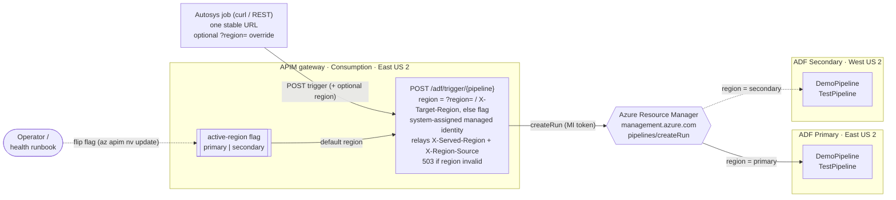
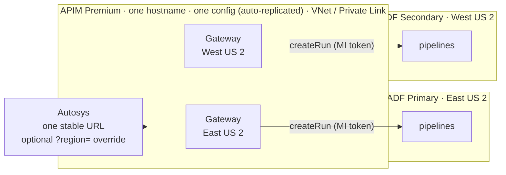

# ADF Cross-Region DR — APIM active-region routing

A deployable reference demo that answers a real customer question:

> *"We trigger Azure Data Factory pipelines from Autosys using the ADF REST API. Without
> changing anything on the application side, can APIM send the request to the ADF factory in
> whichever region is currently active, and fail over without changing the application?"*

**Short answer:** yes. Put a thin **API Management (APIM)** façade in front of ADF that exposes
one stable endpoint and decides which regional factory to trigger. The region can be chosen two
ways: an **operator-controlled `active-region` flag** (default — callers change nothing), or a
**per-request override** (`?region=` or an `X-Target-Region` header) for callers that want to
target a region explicitly. Either way the caller uses the **same URL**, and APIM's managed
identity calls ADF on its behalf.

```
Autosys ─▶ APIM   POST /adf/trigger/{pipeline}[?region=primary|secondary]
             │  region = ?region= / X-Target-Region  →  else active-region flag
             ├─ primary   ─▶ Data Factory (East US 2)   → returns runId
             └─ secondary ─▶ Data Factory (West US 2)   → returns runId
```

Each response carries `X-Served-Region` (which region ran it) and `X-Region-Source` (`flag` or
`request`). **For production we recommend deploying this on
[APIM Premium multi-region](#recommended-production-architecture--apim-premium-multi-region)** so
the endpoint itself survives a regional outage and can use private networking (VNet / Private
Link). This repo deploys a single **Consumption**-tier APIM as a low-cost validation of the
identical routing logic.

---

## Architecture



### Request flow
1. Autosys calls `POST https://<apim-host>/adf/trigger/{pipeline}` — one unchanging URL. Any
   pipeline deployed to the active factory works (the demo ships `DemoPipeline` and `TestPipeline`).
2. The APIM policy reads the **`active-region`** named value — returning **503** if it is not
   `primary`/`secondary` — and builds the ADF `createRun` URL for that region's factory,
   URL-encoding the pipeline name.
3. It attaches an ARM token from APIM's **system-assigned managed identity** (which holds
   **Data Factory Contributor** on **both** factories) and calls `createRun` via Azure Resource
   Manager.
4. ADF starts the pipeline run and returns a `runId`, which APIM relays with an
   `X-Served-Region` header. To fail over, an operator or health runbook flips the flag.

---

## Choosing the region

APIM decides the target region in one of two ways, then triggers **only** that region and
returns its real response (no automatic cross-region retry, which keeps triggering deterministic
and avoids double-runs):

1. **Per-request override** — the caller passes `?region=primary|secondary` or an
   `X-Target-Region` header. Use this for a controlled cutover, testing, or a scheduler that
   already knows which region it wants.
2. **`active-region` flag (default)** — when no per-request region is supplied, APIM uses the
   `active-region` named value. Callers change nothing; an **operator** or an **automated health
   runbook** flips the flag (`scripts/switch-region` or `az apim nv update`) to fail over.

Each response reports `X-Served-Region` (which region ran it) and `X-Region-Source` (`request`
or `flag`). An unrecognized region returns **503** rather than silently defaulting.

> **Why no automatic cross-region retry?** `createRun` returning `200` only means ARM *accepted*
> the run — not that the pipeline will succeed (a region's integration runtime or data tier
> could be down while ARM is fine). And because `createRun` is **not idempotent**, silently
> retrying the other region on a lost response could start the pipeline **twice**. Driving
> failover from an explicit signal (request or flag) avoids both problems.

---

## Repository layout

```
infra/
  main.bicep                 # Orchestration (RG-scoped): 1 APIM, 2 ADF, role assignments
  main.parameters.json       # Sample parameters
  modules/
    dataFactory.bicep        # ADF + two dependency-free pipelines: DemoPipeline (Wait) and TestPipeline (parameterized)
    apim.bicep               # APIM Consumption + MI + active-region /adf/trigger policy
policies/
  active-region-policy.xml   # Human-readable copy of the active-region routing policy
scripts/
  deploy.{sh,ps1}            # Create RG + deploy
  demo.{sh,ps1}              # Call the single endpoint, print serving region + failover flag
  switch-region.{sh,ps1}     # Flip the active-region flag (no app change)
  teardown.{sh,ps1}          # Delete everything (one resource group)
docs/
  architecture.md            # Deeper design notes + production hardening
  ADF-CrossRegion-DR-Recommendation.docx   # Customer-facing recommendation report
  images/architecture-premium.png          # Premium multi-region diagram (used by the report)
```

---

## Prerequisites

- **Azure CLI** 2.60+ and **Bicep** (`az bicep install`)
- Signed in: `az login` and `az account set --subscription "<name-or-id>"`
- Role: **Owner** or **User Access Administrator** on the subscription/RG
  (needed to grant APIM's identity **Data Factory Contributor**)
- Providers registered (the deploy handles this if you haven't):
  ```bash
  az provider register -n Microsoft.ApiManagement
  az provider register -n Microsoft.DataFactory
  ```

---

## Deploy

```bash
# bash
export PUBLISHER_EMAIL="you@contoso.com"
./scripts/deploy.sh
```
```powershell
# PowerShell
.\scripts\deploy.ps1 -PublisherEmail you@contoso.com
```

APIM **Consumption** tier provisions in a few minutes (vs ~30–45 min for Developer/Premium),
which keeps this demo fast and cheap. The deploy prints outputs including `apimHost` and
`triggerUrl`.

---

## Run the demo

```bash
./scripts/demo.sh
```
```powershell
.\scripts\demo.ps1
```

Expected output (abridged) — note `X-Served-Region`:

```
Application endpoint (unchanged across failovers):
  POST https://apim-adfdr-pri-xxxx.azure-api.net/adf/trigger/DemoPipeline
HTTP/1.1 200 OK
X-Served-Region: primary
X-Region-Source: flag
{"runId":"e1f2...."}
```

## Fail over — no application change

```bash
./scripts/demo.sh                     # served by primary
./scripts/switch-region.sh secondary  # flip the active-region flag (APIM-side)
./scripts/demo.sh                     # SAME URL, now served by secondary
./scripts/switch-region.sh primary    # flip back
```
```powershell
.\scripts\demo.ps1
.\scripts\switch-region.ps1 -Region secondary
.\scripts\demo.ps1
.\scripts\switch-region.ps1 -Region primary
```

After the switch, `X-Served-Region` flips to `secondary` and the pipeline runs in the secondary
factory — same client, same hostname, zero application changes.

### Per-request region override

A caller can also target a region explicitly, without touching the flag:

```bash
./scripts/demo.sh secondary                       # or: REGION=secondary ./scripts/demo.sh
curl -X POST "https://<apim-host>/adf/trigger/TestPipeline?region=secondary"
curl -X POST -H "X-Target-Region: secondary" "https://<apim-host>/adf/trigger/TestPipeline"
```
```powershell
.\scripts\demo.ps1 -Region secondary
```

The response then shows `X-Served-Region: secondary` and `X-Region-Source: request`. With no
region supplied, `X-Region-Source: flag` and the `active-region` value decides.

### Triggering other pipelines

The endpoint takes the pipeline name in the path, so it triggers **any** pipeline that exists in
the active region's factory. The repo deploys two into both factories:

- `DemoPipeline` — a single `Wait` activity.
- `TestPipeline` — a parameterized pipeline (`message` parameter with a default) that sets a
  variable then waits, showing that parameterized pipelines trigger fine with the current policy.

```bash
curl -X POST https://<apim-host>/adf/trigger/TestPipeline
```

Because the deployed policy sends an empty body (`{}`), pipeline parameters use their defaults.
To pass caller-supplied parameters through to `createRun`, forward the request body in the
policy instead of `{}` (see [`docs/architecture.md`](docs/architecture.md)).

---

## Production hardening

This repo keeps the demo **cheap, fast, and credential-free**. For a production rollout:

| Area | Demo | Production |
|---|---|---|
| **Resilient ingress** | A single APIM instance (one region) is the ingress point | Deploy the same policy on **APIM Premium multi-region** so the endpoint survives losing a region (see [Recommended production architecture](#recommended-production-architecture--apim-premium-multi-region)). |
| **APIM tier** | Consumption (fast/cheap) | **Premium** — multi-region, VNet / Private Link, 99.99% SLA |
| **Auth to APIM** | `subscriptionRequired: false` (open) | Require a **subscription key**, client cert (mTLS), or OAuth; restrict source IPs to the Autosys hosts |
| **Active-region signal** | Manual flag flip | Drive the flag from an **automated health runbook** keyed on real IR/data-plane health (a canary pipeline or health endpoint), not just `createRun` acceptance |
| **Data-tier DR** | Not included (pipeline has no data deps) | The real DR boundary is your **data + integration runtimes**: geo-redundant storage (GRS/RA-GRS), SQL failover groups, Key Vault replication, and **Self-hosted IR in HA (2+ nodes)**. ADF itself is redeployable code — keep it in Git/CD. |

> **Full DR** = this active-region *backend* selection running on *multi-region ingress*. The
> recommended way to get both is **APIM Premium multi-region** (below).

---

## Recommended production architecture — APIM Premium multi-region

The single Consumption APIM in this demo is a one-region ingress point: if that region is lost,
the endpoint goes with it. For production we recommend running the **same routing policy** on a
single **APIM Premium** service with **gateways in two (or more) regions** behind one hostname.
Microsoft manages the cross-region routing and replicates **one configuration**, so the policy
and `active-region` flag exist once and cannot drift.



Why Premium multi-region is the recommendation:

- **Survives a regional outage** — gateways in multiple regions behind one hostname; losing a
  region keeps the endpoint serving from the survivor, with no external router for you to operate.
- **Private networking** — Premium supports **VNet integration / Private Link**, so Autosys can
  reach the endpoint privately and APIM can sit inside your network. Consumption cannot, and a
  public global router (Front Door / Traffic Manager) is not an option when ingress must stay
  private. This is the deciding factor for customers using **private endpoints**.
- **One configuration** — policy + `active-region` flag are defined once and auto-replicated, so
  the two regions can't fall out of sync.
- **Enterprise SLA** — 99.99% with availability zones.
- **Region-aware routing option** — in Premium the policy can read the serving gateway's region
  (`context.Deployment.Region`) and trigger the co-located ADF automatically, so a regional
  outage needs no flag change. The per-request `?region=` override and the `active-region` flag
  still work for controlled cutovers and data-plane-only failovers.

### Cost

| Component | Basis (list price, East US 2) | Est. / month |
|---|---|---|
| APIM Premium — primary region | 1 unit × $3.83/hr × 730 hrs | ~$2,796 |
| APIM Premium — secondary region | 1 unit × $1.91/hr × 730 hrs | ~$1,394 |
| Azure Data Factory × 2 | Idle factories are free; orchestration ~$1/1,000 runs | ~$2 |
| **Total (approx.)** | Single logical, config-replicated, VNet-capable service | **~$4,190** |

> Premium is materially more expensive than the Consumption demo, but it is the tier that
> delivers regional-outage survival **and** private networking. Planning estimate from the Azure
> Retail Prices API (list price, East US 2, July 2026); confirm against the Azure Pricing
> Calculator and your agreement before budgeting.

> **The real DR boundary is still your data plane.** Whichever tier fronts the trigger, the
> pipelines' data dependencies (storage, SQL, Key Vault) and **integration runtimes** must be
> resilient per region — geo-redundant storage, SQL failover groups, and Self-hosted / Managed
> VNet IR stood up in **both** factories. See [`docs/architecture.md`](docs/architecture.md).

> 📄 A customer-facing summary of this recommendation (with the diagram and cost estimate) is in
> [`docs/ADF-CrossRegion-DR-Recommendation.docx`](docs/ADF-CrossRegion-DR-Recommendation.docx).

---

## Security notes

- The demo API is **unauthenticated** for simplicity. **Do not** leave `subscriptionRequired: false`
  in production — require a key/cert/OAuth and lock down source IPs.
- Because the pipeline name is taken from the URL path, an unauthenticated endpoint lets a caller
  start **any** pipeline in the target factory. In production, require auth **and** restrict which
  pipeline names can be triggered (e.g. an allow-list in the policy). The policy URL-encodes the
  pipeline name and returns `503` if the region (from `?region=`, `X-Target-Region`, or the
  `active-region` flag) is not `primary`/`secondary`.
- APIM uses a **system-assigned managed identity** scoped to **Data Factory Contributor** on the
  two factories — least privilege, no secrets in Autosys.
- The policy targets the Azure **commercial** cloud ARM endpoint (`management.azure.com`). For
  Azure Government/China, parameterize the ARM host.
- No credentials are stored in this repo.

## Cost

Consumption APIM is pay-per-call (first 1M calls/month free), and ADF has no standing cost for an
idle factory. A full demo run costs **pennies**. Run `teardown` when done:

```bash
./scripts/teardown.sh
```
```powershell
.\scripts\teardown.ps1
```

---

## License

MIT — see [LICENSE](LICENSE).
