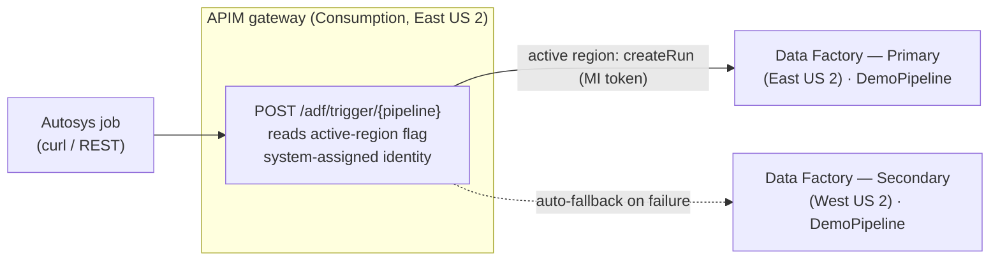

# ADF Cross-Region DR — APIM active-region routing

A deployable reference demo that answers a real customer question:

> *"We trigger Azure Data Factory pipelines from Autosys using the ADF REST API. Without
> changing anything on the application side, can APIM send the request to the ADF factory in
> whichever region is currently active — and fail over automatically?"*

**Short answer:** yes. Put a thin **API Management (APIM)** façade in front of ADF that exposes
one stable endpoint, and let an **`active-region` flag** inside APIM decide which regional
factory to trigger. If the active region's call fails, the policy **automatically falls back**
to the other region. The calling application always uses the **same URL** — failover happens
entirely inside APIM, with no app change and no external router.

```
Autosys ─▶ APIM   POST /adf/trigger/{pipeline}
             │  reads named value  active-region = primary | secondary
             ├─ active  ─▶ Data Factory (active region)   → returns runId
             └─ on failure, auto-fallback ─▶ Data Factory (standby region)
```

The caller never touches Azure AD tokens or region-specific URLs — APIM's **managed identity**
calls ADF's `createRun` API on its behalf, and responses carry `X-Served-Region`
(`primary`/`secondary`) and `X-Failover` (`true`/`false`) so you can see what happened.

---

## Architecture



### Request flow
1. Autosys calls `POST https://<apim-host>/adf/trigger/DemoPipeline` — one unchanging URL.
2. The APIM policy reads the **`active-region`** named value and builds the ADF `createRun`
   URL for that region's factory.
3. It attaches an ARM token from APIM's **system-assigned managed identity** (which holds
   **Data Factory Contributor** on **both** factories) and calls `createRun`.
4. If that call fails, the policy **automatically retries the other region** and marks the
   response `X-Failover: true`.
5. ADF starts the pipeline run and returns a `runId`.

---

## How the "active region" is decided

The `active-region` named value is the source of truth. Flip it — with `scripts/switch-region`
or `az apim nv update` — during a declared failover; no application change is required. Two
complementary mechanisms:

- **Controlled switch (the flag):** an operator, or an **automated health runbook** that
  watches real data-plane / integration-runtime health, sets `active-region` to the region
  that should serve traffic.
- **Automatic fallback (the policy):** if the active region's `createRun` call outright fails,
  the policy immediately tries the other region so a single request still succeeds.

> **Why both?** `createRun` returning `200` only means ARM *accepted* the run — not that the
> pipeline will succeed (a region's integration runtime or data tier could be down while ARM
> is fine). Automatic fallback covers a hard `createRun` failure; the flag covers a *declared*
> failover driven by a real health signal.

---

## Repository layout

```
infra/
  main.bicep                 # Orchestration (RG-scoped): 1 APIM, 2 ADF, role assignments
  main.parameters.json       # Sample parameters
  modules/
    dataFactory.bicep        # ADF + a dependency-free DemoPipeline (single Wait activity)
    apim.bicep               # APIM Consumption + MI + active-region /adf/trigger policy
policies/
  active-region-policy.xml   # Human-readable copy of the active-region routing policy
scripts/
  deploy.{sh,ps1}            # Create RG + deploy
  demo.{sh,ps1}              # Call the single endpoint, print serving region + failover flag
  switch-region.{sh,ps1}     # Flip the active-region flag (no app change)
  teardown.{sh,ps1}          # Delete everything (one resource group)
docs/
  architecture.md            # Deeper design notes + production hardening
```

---

## Prerequisites

- **Azure CLI** 2.60+ and **Bicep** (`az bicep install`)
- Signed in: `az login` and `az account set --subscription "<name-or-id>"`
- Role: **Owner** or **User Access Administrator** on the subscription/RG
  (needed to grant APIM's identity **Data Factory Contributor**)
- Providers registered (the deploy handles this if you haven't):
  ```bash
  az provider register -n Microsoft.ApiManagement
  az provider register -n Microsoft.DataFactory
  ```

---

## Deploy

```bash
# bash
export PUBLISHER_EMAIL="you@contoso.com"
./scripts/deploy.sh
```
```powershell
# PowerShell
.\scripts\deploy.ps1 -PublisherEmail you@contoso.com
```

APIM **Consumption** tier provisions in a few minutes (vs ~30–45 min for Developer/Premium),
which keeps this demo fast and cheap. The deploy prints outputs including `apimHost` and
`triggerUrl`.

---

## Run the demo

```bash
./scripts/demo.sh
```
```powershell
.\scripts\demo.ps1
```

Expected output (abridged) — note `X-Served-Region` and `X-Failover`:

```
Application endpoint (unchanged across failovers):
  POST https://apim-adfdr-pri-xxxx.azure-api.net/adf/trigger/DemoPipeline
HTTP/1.1 200 OK
X-Served-Region: primary
X-Failover: false
{"runId":"e1f2...."}
```

## Fail over — no application change

```bash
./scripts/demo.sh                     # served by primary
./scripts/switch-region.sh secondary  # flip the active-region flag (APIM-side)
./scripts/demo.sh                     # SAME URL, now served by secondary
./scripts/switch-region.sh primary    # flip back
```
```powershell
.\scripts\demo.ps1
.\scripts\switch-region.ps1 -Region secondary
.\scripts\demo.ps1
.\scripts\switch-region.ps1 -Region primary
```

After the switch, `X-Served-Region` flips to `secondary` and the pipeline runs in the secondary
factory — same client, same hostname, zero application changes.

---

## Production hardening

This repo keeps the demo **cheap, fast, and credential-free**. For a production rollout:

| Area | Demo | Production |
|---|---|---|
| **Resilient ingress** | A single APIM instance (one region) is the ingress point | The single gateway is a one-region dependency. To also survive losing the APIM's region, run this same active-region policy on **APIM Premium multi-region** (one hostname, gateways in N regions) or front two APIM instances with **Azure Front Door**. |
| **APIM tier** | Consumption (fast/cheap) | **Premium** (multi-region, VNet, SLA) or Developer for non-prod |
| **Auth to APIM** | `subscriptionRequired: false` (open) | Require a **subscription key**, client cert (mTLS), or OAuth; restrict source IPs to the Autosys hosts |
| **Active-region signal** | Manual flag flip | Drive the flag from an **automated health runbook** keyed on real IR/data-plane health (a canary pipeline or health endpoint), not just `createRun` acceptance |
| **Data-tier DR** | Not included (pipeline has no data deps) | The real DR boundary is your **data + integration runtimes**: geo-redundant storage (GRS/RA-GRS), SQL failover groups, Key Vault replication, and **Self-hosted IR in HA (2+ nodes)**. ADF itself is redeployable code — keep it in Git/CD. |

> **Full DR** = active-region *backend* selection (this repo) running on *multi-region ingress*
> (APIM Premium multi-region or Front Door). That gives you a resilient front door **and**
> automatic routing to the healthy ADF region.

---

## Security notes

- The demo API is **unauthenticated** for simplicity. **Do not** leave `subscriptionRequired: false`
  in production — require a key/cert/OAuth and lock down source IPs.
- APIM uses a **system-assigned managed identity** scoped to **Data Factory Contributor** on the
  two factories — least privilege, no secrets in Autosys.
- No credentials are stored in this repo.

## Cost

Consumption APIM is pay-per-call (first 1M calls/month free), and ADF has no standing cost for an
idle factory. A full demo run costs **pennies**. Run `teardown` when done:

```bash
./scripts/teardown.sh
```
```powershell
.\scripts\teardown.ps1
```

---

## License

MIT — see [LICENSE](LICENSE).
