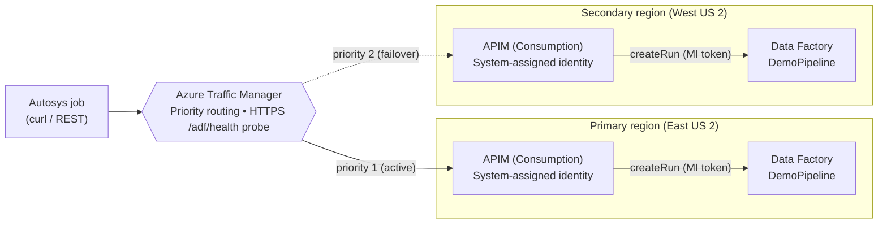

# ADF Cross-Region DR — Traffic Manager + APIM + Data Factory

A deployable reference demo that answers a real customer question:

> *"We trigger Azure Data Factory pipelines from Autosys using the ADF REST API. Can we
> put that behind Traffic Manager so it survives a regional outage?"*

**Short answer:** you don't put the ADF control-plane API itself behind Traffic Manager —
you put a thin **API Management (APIM)** façade in front of ADF, deploy that façade in **two
regions**, and let **Azure Traffic Manager** hand out one stable hostname with automatic
regional failover.

```
Autosys  ─▶  Traffic Manager  ─┬─(priority 1)─▶  APIM (Primary)   ─▶  Data Factory (Primary)
   one stable hostname         └─(priority 2)─▶  APIM (Secondary) ─▶  Data Factory (Secondary)
```

Autosys just does `POST https://<stable-name>/adf/trigger/<pipeline>`. It never touches
Azure AD tokens or region-specific URLs — APIM's **managed identity** calls ADF's `createRun`
API on its behalf. When the primary region is unhealthy, Traffic Manager's health probe fails
it out and the **same hostname** resolves to the secondary region.

---

## Architecture



### Request flow
1. Autosys calls `POST https://<traffic-manager-fqdn>/adf/trigger/DemoPipeline`.
2. Traffic Manager resolves the hostname to the **healthy, highest-priority** APIM gateway.
3. That APIM operation runs a policy that:
   - builds the ADF `createRun` URL for the requested pipeline,
   - attaches an ARM token from APIM's **system-assigned managed identity**
     (which holds **Data Factory Contributor** on the regional factory),
   - relays ADF's response and stamps `X-Served-Region` so you can see the active region.
4. ADF starts the pipeline run and returns a `runId`.

---

## Why not put ADF *directly* behind Traffic Manager?

`https://management.azure.com/.../factories/{name}/pipelines/{p}/createRun` is the **Azure
Resource Manager control plane** — a shared, global Microsoft endpoint. You can't front it
with your own Traffic Manager profile, and it already requires an Azure AD token per call.
The APIM façade gives you:

- a **stable, ownable hostname** you can point Traffic Manager (or Front Door) at,
- **credential isolation** — Autosys uses a simple key/secret, not Azure AD,
- a place to add **throttling, logging, IP allow-lists, request shaping**,
- clean **per-region failover** decoupled from ADF itself.

---

## Repository layout

```
infra/
  main.bicep                 # Orchestration (RG-scoped): 2x ADF, 2x APIM, RBAC, Traffic Manager
  main.parameters.json       # Sample parameters
  modules/
    dataFactory.bicep        # ADF + a dependency-free DemoPipeline (single Wait activity)
    apim.bicep               # APIM Consumption + MI + /trigger/{pipeline} + /health policies
    trafficManager.bicep     # Priority profile + HTTPS health probe + 2 external endpoints
policies/
  trigger-policy.xml         # Human-readable copy of the trigger operation policy
  health-policy.xml          # Human-readable copy of the health operation policy
scripts/
  deploy.{sh,ps1}            # Create RG + deploy
  demo.{sh,ps1}              # Trigger through Traffic Manager, print the serving region
  failover.{sh,ps1}          # Toggle the primary endpoint to prove failover
  teardown.{sh,ps1}          # Delete everything (one resource group)
docs/
  architecture.md            # Deeper design notes + production hardening
```

---

## Prerequisites

- **Azure CLI** 2.60+ and **Bicep** (`az bicep install`)
- Signed in: `az login` and `az account set --subscription "<name-or-id>"`
- Role: **Owner** or **User Access Administrator** on the subscription/RG
  (needed to grant APIM's identity **Data Factory Contributor**)
- Providers registered (the deploy handles this if you haven't):
  ```bash
  az provider register -n Microsoft.ApiManagement
  az provider register -n Microsoft.DataFactory
  az provider register -n Microsoft.Network
  ```

---

## Deploy

```bash
# bash
export PUBLISHER_EMAIL="you@contoso.com"
./scripts/deploy.sh
```
```powershell
# PowerShell
.\scripts\deploy.ps1 -PublisherEmail you@contoso.com
```

APIM **Consumption** tier provisions in a few minutes (vs ~30–45 min for Developer/Premium),
which keeps this demo fast and cheap. The deploy prints outputs including
`trafficManagerFqdn` and both APIM hostnames.

---

## Run the demo

```bash
./scripts/demo.sh
```
```powershell
.\scripts\demo.ps1
```

Expected output (abridged) — note `X-Served-Region`:

```
 Traffic Manager hostname : adfdr-xxxx.trafficmanager.net
 Active APIM gateway      : apim-adfdr-pri-xxxx.azure-api.net
POST https://apim-adfdr-pri-xxxx.azure-api.net/adf/trigger/DemoPipeline
HTTP/1.1 200 OK
X-Served-Region: eastus2
X-Served-Factory: adf-adfdr-pri-xxxx
{"runId":"e1f2...."}
```

## Demonstrate failover

```bash
./scripts/failover.sh fail     # disable the primary Traffic Manager endpoint
./scripts/demo.sh              # now served by the SECONDARY region
./scripts/failover.sh restore  # bring primary back
```
```powershell
.\scripts\failover.ps1 -Action fail
.\scripts\demo.ps1
.\scripts\failover.ps1 -Action restore
```

After failover, `X-Served-Region` flips to `westus2` and the pipeline runs in the
secondary factory — same client, same hostname, zero Autosys changes.

> The scripts disable the Traffic Manager **endpoint** to make failover instant and
> scripted. In a real outage, the **HTTPS `/adf/health` probe** fails on its own and
> Traffic Manager withdraws the endpoint after `toleratedNumberOfFailures` (default 3).

---

## From demo to production

This repo keeps the demo **cheap, fast, and credential-free**. For a production rollout,
tighten these (see [`docs/architecture.md`](docs/architecture.md) for detail):

| Area | Demo | Production |
|---|---|---|
| **Stable hostname / TLS** | Clients resolve the TM CNAME to the active `*.azure-api.net` host | Put a **customer-owned custom domain** (e.g. `adf.contoso.com`) on **both** APIM instances with the **same TLS cert**, then CNAME it to the Traffic Manager FQDN. Clients use one name with a valid cert. |
| **APIM tier** | Consumption (fast/cheap) | **Premium** (multi-region, VNet integration, SLA) or Developer for non-prod |
| **Auth to APIM** | `subscriptionRequired: false` (open) | Require a **subscription key**, client cert (mTLS), or OAuth; restrict source IPs to the Autosys hosts |
| **L7 vs DNS failover** | Traffic Manager (DNS) | Traffic Manager is ideal for API/non-HTTP-content failover. If you want **L7 host-header rewrite + managed TLS + faster failover**, consider **Azure Front Door** in front of the two APIM gateways instead. |
| **Data-tier DR** | Not included (pipeline has no data deps) | The real DR boundary is your **data + integration runtimes**: geo-redundant storage (GRS/RA-GRS), SQL failover groups, Key Vault replication, and **Self-hosted IR in HA (2+ nodes)**. ADF itself is redeployable code — keep it in Git/CD. |

---

## Security notes

- The demo API is **unauthenticated** for simplicity. **Do not** leave `subscriptionRequired: false`
  in production — require a key/cert/OAuth and lock down source IPs.
- APIM uses a **system-assigned managed identity** scoped to **Data Factory Contributor** on
  **only** its regional factory — least privilege, no secrets in Autosys.
- No credentials are stored in this repo.

## Cost

Consumption APIM is pay-per-call (first 1M calls/month free), ADF has no standing cost for an
idle factory, and Traffic Manager is a few cents per million DNS queries plus a small
per-profile fee. A full demo run costs **pennies**. Run `teardown` when done:

```bash
./scripts/teardown.sh
```
```powershell
.\scripts\teardown.ps1
```

---

## License

MIT — see [LICENSE](LICENSE).
