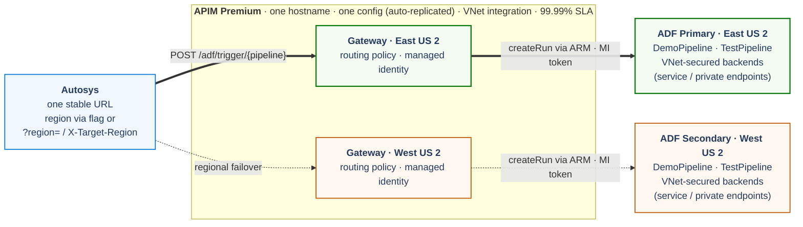

# Architecture & design notes

This document expands on the [README](../README.md) with the reasoning, trade-offs, and
production-hardening guidance behind the demo.

## Components

| Resource | Type | Purpose |
|---|---|---|
| APIM | `Microsoft.ApiManagement/service` (Consumption) | One gateway exposing `POST /adf/trigger/{pipelineName}`. Holds a system-assigned managed identity and the `active-region` named value. |
| Data Factory (x2) | `Microsoft.DataFactory/factories` | Regional factories, each with a dependency-free `DemoPipeline` (single `Wait` activity). |
| Role assignment (x2) | `Microsoft.Authorization/roleAssignments` | Grants the APIM identity **Data Factory Contributor** on **both** factories. |

Everything is deployed into **one resource group** so teardown is a single `az group delete`.
Resources are regional but a resource group is just metadata — the region of each resource is
set per-module.

## The routing policy

The operation policy on `POST /adf/trigger/{pipelineName}`:

1. Determines the target region: a per-request `?region=` query parameter or `X-Target-Region`
   header if present, otherwise the `{{active-region}}` named value. Reports the choice via an
   `X-Region-Source` header (`request` or `flag`).
2. Selects the factory for that region (primary or secondary); an unrecognized region returns
   `503` rather than defaulting.
3. `send-request` (with `authentication-managed-identity`) calls `createRun` on that factory,
   URL-encoding the pipeline name.
4. Returns the factory's real status and body, plus `X-Served-Region` and `X-Region-Source`.
   There is no automatic cross-region retry.

A human-readable copy lives in [`policies/active-region-policy.xml`](../policies/active-region-policy.xml).
The version deployed by `infra/modules/apim.bicep` substitutes `__SUB__`, `__RG__`,
`__PRIFACTORY__`, `__SECFACTORY__` and XML-escapes operators (`<`→`&lt;`, `"`→`&quot;`).

### Passing pipeline parameters

The demo policy sends an empty body (`<set-body>{}</set-body>`), so triggered pipelines run
with their default parameter values. To let callers pass parameters through to `createRun`,
relay the incoming request body instead — e.g. `<set-body>@(context.Request.Body.As<string>(preserveContent: true))</set-body>`
— and have Autosys POST a JSON object of pipeline parameters. `TestPipeline` demonstrates a
parameterized pipeline; with the default policy it uses the default `message` value.

## Managed identity & least privilege

APIM authenticates to ADF with its **system-assigned managed identity** via the
`authentication-managed-identity` policy (resource `https://management.azure.com/`). The identity
is granted **Data Factory Contributor** (`673868aa-7521-48a0-acc6-0f60742d39f5`) on **both**
factories — which is what lets a single gateway trigger either region. No secrets live in
Autosys, APIM, or this repo. For tighter scope, a custom role limited to
`Microsoft.DataFactory/factories/pipelines/createRun/action` (plus read) also works.

## Choosing the region

The target region is decided per request, in this order:

1. **Per-request override** — a `?region=primary|secondary` query parameter, or an
   `X-Target-Region` header. This lets a caller target a region explicitly (controlled cutover,
   testing, a region-aware scheduler) without any operator action.
2. **`active-region` named value** — the fallback when no per-request region is supplied. Flip it
   with `scripts/switch-region` or `az apim nv update`; the gateway picks up the change within
   seconds. Set it from an operator during a declared failover, or from an automated health
   runbook that watches real data-plane / integration-runtime health.

Either way APIM triggers only the chosen region and returns its real response, tagged with
`X-Served-Region` and `X-Region-Source`. An unrecognized region returns `503`.

Failover is intentionally deterministic, not an automatic cross-region retry: because
`createRun` is not idempotent, silently retrying the other region on a lost response could start
the pipeline twice.

Note the subtlety: `createRun` returning `200` only means ARM **accepted** the run — it does not
prove the pipeline will succeed (a region's integration runtime or data tier could be down while
ARM is healthy). A production failover signal should reflect **real data-plane / IR health**
(a canary pipeline or a customer health endpoint), not merely trigger acceptance.

## Recommended production architecture: APIM Premium multi-region

Moving region selection into APIM removes the need for an external router for **backend
selection** — but a single APIM instance is itself a **single-region ingress point**. If that
region is lost, nothing routes. The recommended way to make the ingress resilient too is **APIM
Premium multi-region**: one logical APIM with gateways in multiple regions behind a single
hostname, Microsoft-managed cross-region routing, and **one auto-replicated configuration** (the
policy and `active-region` flag exist once and cannot drift).

Why Premium (not a public global router such as Front Door or Traffic Manager):

- **Runs inside your VNet.** Premium supports **VNet integration**, so APIM sits in your network
  and reaches ADF and other Azure services over the Azure backbone rather than the public
  internet. Because the workload is entirely in Azure (not on-premises), **service endpoints**
  are enough to secure those backends — free and with no Private DNS to manage. **Private
  endpoints** remain available for per-resource isolation or to disable public access entirely,
  and would be required if a caller ever needed to reach the endpoint from on-premises. Neither a
  public edge router (Front Door) nor a DNS router (Traffic Manager) can sit inside your network.
- **Single configuration.** Policy + flag are replicated across regions automatically; nothing to
  keep in sync.
- **Enterprise SLA** (99.99%) with availability zones.
- **Region-aware routing option.** In Premium the policy can read `context.Deployment.Region` and
  trigger the co-located ADF automatically, so a regional outage needs no flag change. The
  per-request `?region=` override and the `active-region` flag still apply for controlled
  cutovers and for data-plane-only failovers where the APIM region is healthy.

Rough list-price cost (Azure Retail Prices API, East US 2, July 2026): ~$4,190/month (one
Premium unit per region). This is materially more than the Consumption demo, but it is the tier
that delivers regional-outage survival **and** VNet integration. Confirm against the Azure
Pricing Calculator and your agreement before budgeting.

### Securing the traffic: service endpoints vs private endpoints

Both keep traffic to Azure PaaS services (Storage, SQL, Key Vault) off the public internet, but
differently:

- **Service endpoints** keep the service on its public IP but firewall it to your VNet/subnet;
  traffic rides the Azure backbone. Free, no DNS changes, VNet-scoped. Since this workload runs
  **entirely in Azure**, service endpoints are the simplest way to secure the ADF data plane and
  APIM's access to backends.
- **Private endpoints (Private Link)** inject a private IP from your subnet mapped to a specific
  resource instance, let you disable the public endpoint, and are reachable from **on-premises**.
  Choose these for per-resource isolation, stronger exfiltration control, or on-prem reach — at
  the cost of per-endpoint charges and Private DNS management.

The trigger call itself is unaffected either way: it targets **Azure Resource Manager**
(`management.azure.com`), the ADF **control plane**, which is authorized by RBAC — not network
path. So the managed-identity `createRun` keeps working even with a factory's data plane fully
locked down. Network hardening therefore applies to the **ingress** (Autosys → APIM, hence
Premium + VNet) and the **data plane** (below), not to the control-plane trigger.

## The real DR boundary: data + integration runtimes

The factory *definition* is redeployable code — keep it in Git and deploy with CI/CD, exactly as
this repo does. The parts that actually need a DR strategy are the **data plane** and
**connectivity**:

- **Storage:** GRS / RA-GRS; design pipelines to read/write the paired region on failover.
- **Databases:** SQL failover groups / geo-replication; repoint linked services in the standby factory.
- **Secrets:** Key Vault in each region with a secret-sync/replication strategy.
- **Self-hosted IR:** run it in **high availability** (2+ nodes); for cross-region resilience,
  stand up a second SHIR registered to the standby factory.

This demo intentionally uses a pipeline with **no data dependencies** so it deploys cleanly
anywhere and keeps the focus on the **APIM active-region trigger** pattern.

## Naming & idempotency

Globally-unique names (APIM) are derived from `uniqueString(resourceGroup().id)`, so redeploys
into the same resource group are idempotent and reuse the same hostname.
